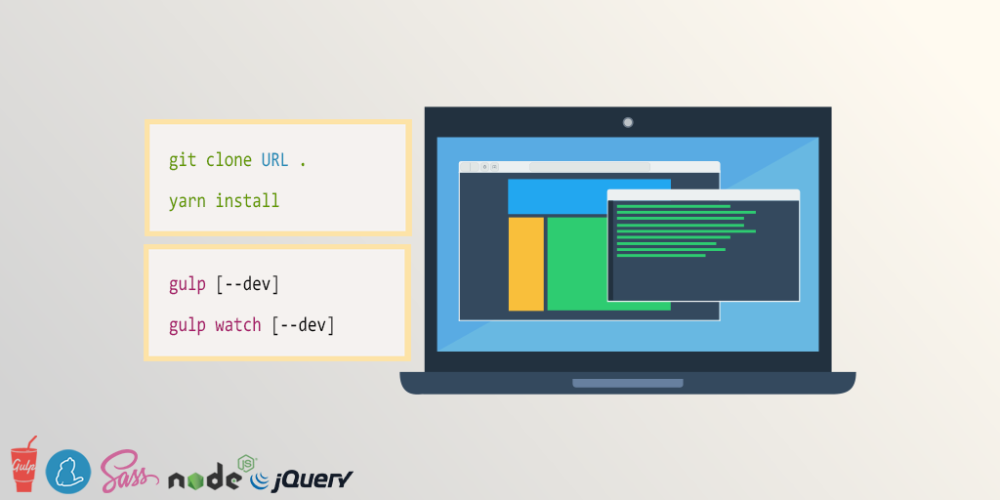

# Frontend Boilerplate

Minimalist and ready to use frontEnd HTML5/CSS/JS Boilerplate for creating new web projects with [Gulp.js](https://gulpjs.com/).

# Getting Started

These instructions will help you run the project on a live system or on your local machine for 
development and testing purposes.

## Dependencies

First, make sure these are installed on your machine :

- [Node.js](http://nodejs.org)
- [Yarn](https://yarnpkg.com/)
- [Gulp](http://gulpjs.com)

## Quick start

1. In bash/terminal/command line, `cd` into your project directory.
2. Clone this repo or download zip.
3. Run `yarn install` to install required files.
4. When it's done installing, run one of the task runners to get going :
	- `gulp` manually compiles HTML/CSS/JS files.
	- `gulp watch --dev` automatically compiles HTML/CSS/JS and spies on files changes.
	- `gulp watch --dev --reload` automatically reload browser.
	
Consider using the `--dev` option for development and testing purposes **only**.

:+1::rocket::+1::rocket::+1::rocket::+1::rocket::+1::rocket::+1::rocket::+1:

# Configuration

Everything you need is in */gulp-includes/gulp-configuration.js*.

# Documentation

- [Available Gulp commands](gulp-includes/core/doc/gulp-commands.md)
- [Use external libraries with Yarn](gulp-includes/core/doc/external-libraries.md)
- [SCSS lint - How to bypass gulp check-scss warnings](gulp-includes/core/doc/scss-lint.md)
- [JSHint - How to bypass gulp check-js warnings](gulp-includes/core/doc/jshint.md)
- [Modernizr features detection](gulp-includes/core/doc/modernizr.md)
- [Built-in JavaScript viewport informations (gulp_display)](gulp-includes/core/doc/viewport-framework.md)
- [Responsive image Plugin](gulp-includes/core/doc/responsive-image-plugin.md)

# Maintenance

Update outdated NPM dependencies :

`yarn upgrade-interactive --latest`

# Authors

- Hédi Ben Aba
- [Fidesio](https://www.fidesio.com/)

# License

This project is licensed under the MIT License - see the [LICENSE.md](gulp-includes/core/doc/LICENSE.md) file for 
details
